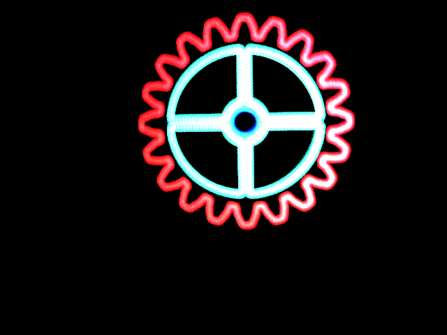

Magic Table
-------------

HBot-based 2D CNC machine for different applications.

# Repository Structure
(Check out each folder's README file for more info on subfolders)

 * /
   * /doc -> Documentation of FESTO hardware parts and tests performed with the machine
   * /firmware ->  Firmware for different embedded devices that that work with the Magic Table
   * /hardware -> Both 3D printable mechanical parts and PCBs for accesories.
   * /software -> Programs to control the Magic Table and use it in different applications.

# Applications developed

## LightPainting
Draw 2D shapes with an RGB light.

## Magic Table
Control different pieces and figures with an electromagnet.

# Credits

 * Author: [David Estevez Fernandez](https://github.com/David-Estevez)

# License

This machine is licensed under a [Creative Commons Attribution-ShareAlike 4.0 International License](http://creativecommons.org/licenses/by-sa/4.0/). Please read the LICENSE files for more details.

Esta maquina tiene una licencia [Creative Commons Attribution-ShareAlike 4.0 International License](http://creativecommons.org/licenses/by-sa/4.0/). Por favor, lea los ficheros LICENSE para más detalles

